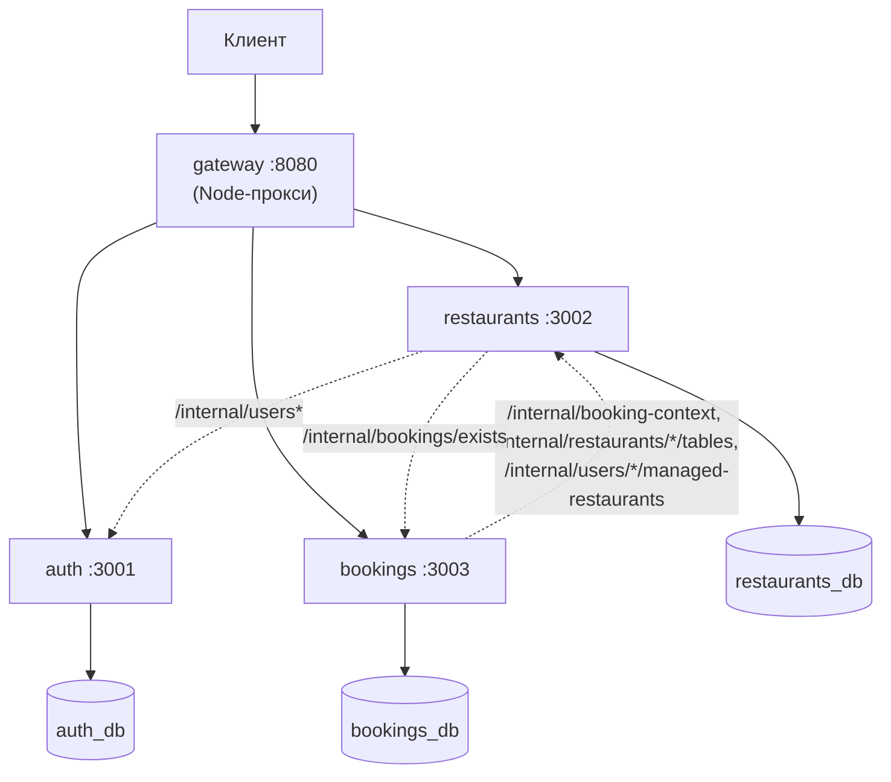

# ЛР2 — бронирование столиков, микросервисы

Бэкенд системы бронирования столиков в ресторанах. Учебный проект курса
«Бэкенд-разработка» (ИТМО), лабораторная работа 2.

Монолит из ЛР1 (`../лр1`) разделён на три микросервиса с отдельными базами данных
и общий gateway. Публичный API не изменился: все 43 операции из `docs/openapi.yaml`
работают по тем же адресам, с теми же телами запросов и кодами ответов — снаружи
разделение на сервисы не видно.

## Архитектура



| Сервис | Порт | База | Отвечает за |
|---|---|---|---|
| gateway | 8080 | — | маршрутизация публичного API (Node/Express-прокси) |
| auth | 3001 | `auth_db` | пользователи, роли, выдача и проверка JWT |
| restaurants | 3002 | `restaurants_db` | города, кухни, рестораны, фото, меню, столики, слоты, отзывы, администраторы ресторана |
| bookings | 3003 | `bookings_db` | брони, поиск свободных столиков |

Один контейнер PostgreSQL, три базы, три пользователя (`dbs/init.sql`) — каждый
сервис подключается только к своей базе.

## Маршрутизация gateway

Префикс `/api/v1`, правила — от точных к общим:

| Путь | Сервис |
|---|---|
| `/auth/*`, `/users/me` (точное совпадение) | auth |
| `/users/me/bookings`, `/bookings`, `/bookings/*` | bookings |
| `/restaurants/{id}/availability` | bookings (несмотря на префикс `/restaurants`) |
| `/cities/*`, `/cuisines/*`, `/restaurants/*`, `/reviews/*` | restaurants |
| `/internal/*` | не публикуется, всегда 404 |

## Внутренний API

Синхронный HTTP между сервисами, защищён заголовком `X-Internal-Token` (значение —
`INTERNAL_API_KEY`, должна совпадать у auth/restaurants/bookings). Через gateway
недоступен. Полное описание — `docs/openapi-internal.yaml`.

| Адрес | Отвечает | Вызывает |
|---|---|---|
| `GET /internal/users?ids=` | auth | restaurants (имена авторов отзывов, список админов ресторана) |
| `GET /internal/users/{userId}` | auth | restaurants (проверка перед назначением администратора) |
| `PATCH /internal/users/{userId}/role` | auth | restaurants (повышение до `RESTAURANT_ADMIN`) |
| `GET /internal/booking-context?table_ids=&time_slot_ids=` | restaurants | bookings (создание брони, свободные столики, история броней) |
| `GET /internal/restaurants/{id}/tables?only_active=&min_capacity=` | restaurants | bookings (поиск свободных столиков) |
| `GET /internal/users/{userId}/managed-restaurants` | restaurants | bookings (брони, доступные `RESTAURANT_ADMIN`) |
| `GET /internal/bookings/exists?table_ids=&time_slot_ids=` | bookings | restaurants (проверка перед удалением столика/слота/ресторана) |

### Для каких ситуаций нужен каждый эндпоинт

Все сценарии — из раздела 10 `CLAUDE.md`, реализованы в коде один в один по номерам.

| Эндпоинт | Когда используется |
|---|---|
| `GET /internal/users?ids=` | Показ имени автора у **отзыва** (список отзывов ресторана, сценарий 8) — пачкой по всем авторам страницы; показ имени в списке **администраторов ресторана** (`GET /restaurants/{id}/admins`) — тоже пачкой по всем `user_id` записей |
| `GET /internal/users/{userId}` | При **назначении администратора ресторана** (`POST /restaurants/{id}/admins`) — проверить, что такой пользователь вообще существует, и узнать его текущую роль (сценарий 6) |
| `PATCH /internal/users/{userId}/role` | Там же, сразу после предыдущего — если роль пользователя была `USER`, повысить до `RESTAURANT_ADMIN` **до** записи в `restaurant_admin` (сценарий 6, «роль меняется первой»). Отдельно — `scripts/seed.js` использует этот же эндпоинт напрямую, чтобы завести самого первого `ADMIN`/`RESTAURANT_ADMIN`, потому что больше никакого способа получить эти роли в системе нет |
| `GET /internal/booking-context?table_ids=&time_slot_ids=` | Три разных места: (1) **создание брони** — проверить, что столик и слот существуют, активны и принадлежат одному ресторану (сценарий 1); (2) **поиск свободных столиков** — получить данные слота (сценарий 2); (3) **показ брони с вложенными данными** — `GET /bookings`, `GET /bookings/{id}`, `GET /users/me/bookings` — один батч-вызов на все id столиков/слотов страницы (сценарий 3) |
| `GET /internal/restaurants/{id}/tables?only_active=&min_capacity=` | **Поиск свободных столиков** — список активных столиков ресторана нужной вместимости, дальше bookings сам вычитает занятые по своей таблице броней (сценарий 2) |
| `GET /internal/users/{userId}/managed-restaurants` | **Список броней для администратора** (`GET /bookings`) — фильтр по ресторанам, которыми управляет `RESTAURANT_ADMIN` (сценарий 4); и **проверка прав на конкретную бронь** (`GET /bookings/{id}`, `PATCH .../status`) — входит ли ресторан этой брони в список управляемых |
| `GET /internal/bookings/exists?table_ids=&time_slot_ids=` | **Удаление столика, слота или ресторана** в restaurants — перед удалением спросить bookings, нет ли на них брони (в любом статусе, история важна); `exists: true` → 409, сбой bookings → 503 и удаление не выполняется (сценарий 7) |

## Структура репозитория

```
лр 2/
├─ CLAUDE.md                — техзадание и правила работы над проектом
├─ docker-compose.yml       — контейнер Postgres (одна база-сервер, три БД)
├─ .env.example             — переменные контейнера Postgres (POSTGRES_*)
├─ dbs/
│  ├─ init.sql              — создание трёх БД и пользователей при первом старте
│  └─ postgres-data/        — данные контейнера (не в git)
├─ docs/
│  ├─ openapi.yaml           — публичный API, 43 операции
│  ├─ openapi-internal.yaml  — внутренний API, 7 операций
│  ├─ postman-collections/   — коллекции и окружение Postman (ДЗ3)
│  └─ PROGRESS.md            — журнал этапов и принятых решений
├─ scripts/seed.js          — тестовые данные
├─ gateway/                 — Node-прокси, порт 8080 (app.ts, routing.ts, proxy.ts)
└─ services/
   ├─ auth/         — порт 3001
   ├─ restaurants/  — порт 3002
   └─ bookings/     — порт 3003
```

Каждый сервис в `services/*` устроен одинаково: `app.ts`, `config/`, `controllers/`,
`dto/`, `models/`, `middlewares/`, `errors/`, `utils/`; у restaurants и bookings
дополнительно `clients/` и `services/` — HTTP-клиенты к другим сервисам.

## Требования

- Node.js 20 (в проекте — бандл `node-v20.17.0-win-x64` рядом с папками `лр 1`/`лр 2`)
- Docker Desktop (для контейнера PostgreSQL)
- Свободные порты: 3001, 3002, 3003, 8080, 15433

## Установка и настройка

Все команды ниже — в PowerShell, открытом в корне проекта (папка `лр 2`, где лежит
этот README — например, «Открыть в терминале» в проводнике). Пути везде
относительные, от корня.

Перед любой командой `node`/`npm` в каждом новом окне PowerShell (бандл Node лежит
на уровень выше корня проекта, см. «Требования»):

```powershell
$env:Path = (Resolve-Path "..\node-v20.17.0-win-x64").Path + ";" + $env:Path
```

Зависимости — в каждой из четырёх папок отдельно, каждая команда в своём окне
(с уже выполненной строкой выше):

```powershell
cd services\auth; npm install
cd services\restaurants; npm install
cd services\bookings; npm install
cd gateway; npm install
```

`.env` — из `.env.example`, в корне и в каждом сервисе (одно окно, без `$env:Path`):

```powershell
Copy-Item .env.example .env
Copy-Item services\auth\.env.example services\auth\.env
Copy-Item services\restaurants\.env.example services\restaurants\.env
Copy-Item services\bookings\.env.example services\bookings\.env
Copy-Item gateway\.env.example gateway\.env
```

### Переменные окружения

| Переменная | Где нужна | Назначение | Значение по умолчанию |
|---|---|---|---|
| `POSTGRES_DB`/`POSTGRES_USER`/`POSTGRES_PASSWORD` | корень (контейнер БД) | админская БД/пользователь контейнера Postgres | см. `.env.example` |
| `APP_HOST` | все 4 сервиса | хост, на котором слушает сервис | `localhost` |
| `APP_PORT` | все 4 сервиса | порт сервиса | 3001/3002/3003/8080 |
| `APP_PROTOCOL` | auth, restaurants, bookings | протокол в строке лога запуска | `http` |
| `APP_API_PREFIX` | все 4 сервиса | префикс публичного API | `/api/v1` |
| `DB_HOST` | auth, restaurants, bookings | хост Postgres | `localhost` |
| `DB_PORT` | auth, restaurants, bookings | порт контейнера Postgres | `15433` |
| `DB_NAME` | auth, restaurants, bookings | имя своей базы | `auth_db`/`restaurants_db`/`bookings_db` |
| `DB_USER`/`DB_PASSWORD` | auth, restaurants, bookings | свой пользователь БД (из `dbs/init.sql`) | см. `.env.example` сервиса |
| `DB_ENTITIES`/`DB_SUBSCRIBERS` | auth, restaurants, bookings | где TypeORM ищет модели/подписчики (dev) | `src/models/*.entity.ts`/`*.subscriber.ts` |
| `JWT_SECRET_KEY` | auth, restaurants, bookings | секрет подписи JWT | см. `.env.example` |
| `JWT_TOKEN_TYPE` | auth, restaurants, bookings | тип токена в ответе auth | `Bearer` |
| `JWT_ACCESS_TOKEN_LIFETIME` | auth, restaurants, bookings | время жизни токена, сек | `300` |
| `INTERNAL_API_KEY` | auth, restaurants, bookings | значение заголовка `X-Internal-Token` | см. `.env.example` |
| `AUTH_SERVICE_URL` | restaurants, gateway | адрес auth | `http://localhost:3001` |
| `RESTAURANTS_SERVICE_URL` | bookings, gateway | адрес restaurants | `http://localhost:3002` |
| `BOOKINGS_SERVICE_URL` | restaurants, gateway | адрес bookings | `http://localhost:3003` |

**`JWT_SECRET_KEY` и `INTERNAL_API_KEY` должны совпадать во всех трёх `.env`**
(auth, restaurants, bookings) — иначе проверка подписи токена или внутреннего
ключа между сервисами не пройдёт. В `.env.example` они уже совпадают.

## Запуск

Порядок: база → четыре сервиса → тестовые данные.

**1. База** (из корня проекта):

```powershell
docker compose up -d
```

**2. Сервисы** — каждый в своём окне PowerShell, открытом в корне проекта (плюс
`$env:Path` из раздела выше в каждом), `npm run dev` держит процесс, не завершается:

```powershell
cd services\auth; npm run dev
cd services\restaurants; npm run dev
cd services\bookings; npm run dev
cd gateway; npm run dev
```

При старте в консоли: `auth-service running on http://localhost:3001` и (кроме
gateway) `Data Source has been initialized!`. Ошибка сразу вместо этого — см.
«Частые проблемы».

**3. Тестовые данные** — когда auth поднялся (из корня проекта):

```powershell
node scripts/seed.js
```

**Проверка** (новое окно, сервисы не трогаем):

```powershell
Invoke-RestMethod http://localhost:8080/api/v1/cities | ConvertTo-Json
```

Ожидается `200` и массив городов — до первого запуска Postman/seed городов ещё нет,
поэтому выведется `[]`. Важно: без `ConvertTo-Json` PowerShell **ничего не печатает**
для пустого массива (`Invoke-RestMethod` возвращает `Object[]` с `Count = 0` —
это не ошибка, а пустой, но успешный ответ), поэтому голая команда без
`ConvertTo-Json` может выглядеть так, будто запрос не сработал.

## Проверка, что сервисы работают

В любой момент, не только сразу после запуска — три проверки по нарастающей.

**1. Какие порты слушаются** (порт есть в выводе → процесс на нём жив):

```powershell
Get-NetTCPConnection -LocalPort 3001,3002,3003,8080 -State Listen -ErrorAction SilentlyContinue |
  Select-Object LocalPort, State
```

**2. База**:

```powershell
docker compose ps
```

`STATUS` должен быть `Up ...`; `Restarting` или пустой вывод — база не работает
(см. «Частые проблемы»).

**3. Сами сервисы отвечают** (порт может слушать, а приложение внутри — упасть на
старте; проверка реальным запросом к каждому):

```powershell
curl.exe -s -o NUL -w "auth: %{http_code}`n" http://localhost:3001/api/v1/users/me
curl.exe -s -o NUL -w "restaurants: %{http_code}`n" http://localhost:3002/api/v1/cities
curl.exe -s -o NUL -w "bookings: %{http_code}`n" http://localhost:3003/api/v1/users/me/bookings
curl.exe -s -o NUL -w "gateway: %{http_code}`n" http://localhost:8080/api/v1/cities
```

Ожидается `auth: 401`, `restaurants: 200`, `bookings: 401`, `gateway: 200` — `401`
у auth/bookings нормален (запрос без токена на защищённый путь), важно, что сервис
вообще ответил, а не молчит/не отдал `503`/не разорвал соединение.

## Остановка

Порядок: сначала сервисы, потом база (обратный не критичен — процессы сервисов не
падают при остановке БД, но начнут отвечать ошибкой на любой запрос к своей базе,
пока её не поднимут обратно).

**Сервисы** — `Ctrl+C` в окне каждого, не закрывать окно крестиком: `npm run dev`
перехватывает `Ctrl+C` и корректно завершает процесс `node`. Если окно/вкладку
терминала закрыть крестиком, процесс `node` иногда остаётся висеть и держать
порт — тогда следующий `npm run dev` в этой же папке упадёт с `EADDRINUSE`.

Проверить, что порты освободились (после `Ctrl+C` во всех четырёх окнах):

```powershell
Get-NetTCPConnection -LocalPort 3001,3002,3003,8080 -State Listen -ErrorAction SilentlyContinue
```

Пустой вывод — всё остановлено. Если порт всё ещё в списке — процесс завис,
завершить принудительно (пример для 3001, для остальных — сменить номер порта):

```powershell
Get-NetTCPConnection -LocalPort 3001 -State Listen |
  Select-Object -ExpandProperty OwningProcess | Stop-Process -Force
```

**База**:

```powershell
docker compose down
```

Данные в `./dbs/postgres-data` не удаляются — см. «Четыре сценария запуска базы».

## Четыре сценария запуска базы

**а) те же данные, тот же контейнер** — обычный перезапуск:

```powershell
docker compose up -d
```

**б) те же данные, контейнер пересоздаётся** — данные в `./dbs/postgres-data`
на диске (bind mount), с контейнером не удаляются:

```powershell
docker compose up -d --force-recreate
```

**в) данные удаляются, контейнер пересоздаётся с нуля** — удаляется только
содержимое `dbs/postgres-data`; `dbs/init.sql` **не трогать** (без него базы и
пользователи не создадутся при следующем старте):

```powershell
docker compose down
Remove-Item -Recurse -Force ".\dbs\postgres-data\*"
docker compose up -d
```

**г) очистить строки таблиц, не удаляя сами таблицы** — базы, пользователи и схема
остаются, счётчики id сбрасываются на 1 (`RESTART IDENTITY`). Подключаться через
`psql` (см. «Подключение к базе» ниже), для каждой базы — свой пользователь и свой
набор таблиц:

```powershell
docker exec -it 2-db-1 psql -U auth_user -d auth_db
```
```sql
TRUNCATE TABLE "user" RESTART IDENTITY CASCADE;
```

```powershell
docker exec -it 2-db-1 psql -U restaurants_user -d restaurants_db
```
```sql
TRUNCATE TABLE city, cuisine, restaurant, restaurant_admin, restaurant_photo,
  menu_item, restaurant_table, time_slot, review RESTART IDENTITY CASCADE;
```

```powershell
docker exec -it 2-db-1 psql -U bookings_user -d bookings_db
```
```sql
TRUNCATE TABLE booking RESTART IDENTITY CASCADE;
```

После каждого — `\q`, чтобы выйти из `psql`. Это необратимо: все текущие тестовые
данные (рестораны, брони, отзывы, сидовые пользователи) будут удалены — после
такой очистки `admin@example.com`/`owner@example.com` пропадут и `scripts/seed.js`
нужно будет запустить заново (см. «Тестовые пользователи»). На самом деле для
повторного прогона Postman это не обязательно — коллекции и без очистки
прекрасно работают на непустой базе (см. «Сквозная проверка»); TRUNCATE нужен
только если хочется навести порядок в тестовых данных.

**Почему `docker compose down` не удаляет данные.** В `docker-compose.yml` есть
строка `./dbs/postgres-data:/var/lib/postgresql/data` — это bind mount: папка
`./dbs/postgres-data` **на вашем диске** подключается внутрь контейнера как путь
`/var/lib/postgresql/data` (именно там Postgres хранит файлы всех баз). То есть
сами файлы баз физически лежат не «внутри контейнера», а прямо на компьютере, в
этой папке — контейнер просто получает окно в неё.

`docker compose down` останавливает и удаляет **контейнер** (сам процесс Postgres
и его временный слой) — но контейнер никогда не «владел» этой папкой, он в неё
только смотрел. Поэтому папка на диске никуда не девается, и при следующем
`docker compose up -d` новый контейнер подключается к той же папке и видит те же
базы, как будто ничего не выключали. Это же объясняет, почему в сценарии «в»
(данные удаляются) стирается именно содержимое `dbs/postgres-data` командой
`Remove-Item`, а не какая-то команда docker — данные ведь не в docker, они в
обычной папке на диске.

## Подключение к базе

Порт `15433` наружу открыт (`docker-compose.yml`) — подключиться можно любым
клиентом, умеющим говорить по протоколу Postgres. Команды ниже не зависят от
текущей папки в терминале — `docker exec` обращается к контейнеру по имени,
а не по пути, так что подойдёт любое окно PowerShell.

Имя контейнера ниже — `2-db-1` (так называется в этом проекте: Docker Compose
формирует его из имени папки `лр 2`). Если у вас оно другое — например, папку
переименовали или склонировали в другое место — точное имя покажет `docker ps`.

### pgAdmin

1. **Servers** (правой кнопкой) → **Register** → **Server...**
2. Вкладка **General** — любое имя, например «ЛР2».
3. Вкладка **Connection**:
   - **Host name/address**: `localhost`
   - **Port**: `15433`
   - **Maintenance database**: `postgres`
   - **Username**: `postgres`
   - **Password**: см. `.env.example` в корне проекта (переменная `POSTGRES_PASSWORD`)
4. **Save**.

В дереве под сервером сразу появятся все базы, включая `auth_db`, `restaurants_db`,
`bookings_db` — pgAdmin, в отличие от некоторых других клиентов, не требует
отдельно включать показ всех баз.

Чтобы зайти сразу под конкретным сервисом (видеть только его базу и данные под
его правами, не под суперпользователем) — заведите отдельный **Server** на
каждую БД, с **Maintenance database** = `auth_db`/`restaurants_db`/`bookings_db`
и логином/паролем этого сервиса (`DB_USER`/`DB_PASSWORD` из `services/*/.env.example`).

### psql (консольный клиент)

Отдельно ставить не нужно — `psql` уже есть внутри контейнера `2-db-1` (образ
`postgres:17`). Подключение — в любом окне PowerShell, из любой папки:

```powershell
docker exec -it 2-db-1 psql -U auth_user -d auth_db
docker exec -it 2-db-1 psql -U restaurants_user -d restaurants_db
docker exec -it 2-db-1 psql -U bookings_user -d bookings_db
```

Пароль спросит интерактивно — берите `DB_PASSWORD` из `.env.example` нужного
сервиса. Дальше — обычные команды `psql`:

- `\dt` — список таблиц текущей базы
- `\d имя_таблицы` — структура таблицы
- `SELECT * FROM "user";` — пример запроса (для `auth_db`; кавычки обязательны,
  `user` — зарезервированное слово Postgres)
- `\q` — выйти

## Сквозная проверка

### Коллекции Postman

`docs/postman-collections/`: `ЛР1 — 1. Сценарии.postman_collection.json`,
`ЛР1 — 2. По группам openapi.postman_collection.json` — сами коллекции, без
изменений. Окружений два: `ЛР1.postman_environment.json` (оригинал ДЗ3, `baseUrl`
на монолит, `localhost:8000`) и `ЛР2.postman_environment.json` (копия с тем же
набором переменных, `baseUrl` уже на gateway, `localhost:8080`) — используйте
второе, редактировать `ЛР1.postman_environment.json` не нужно. Коллекции
запускаются последовательно в одном окружении (вторая переиспользует id первой)
и требуют уже заведённых тестовых пользователей — сначала `scripts/seed.js`.

Коллекции специально устроены так, чтобы запускаться повторно **на непустой базе**
— очищать базы перед повторным прогоном не нужно: город/кухня/ресторан создаются
с `{{$timestamp}}` в названии, гость регистрируется с уникальным email каждый
раз, так что новый прогон не конфликтует со старыми данными и не зависит от того,
пустая база или нет (проверено — два прогона подряд без очистки дали те же
70/70 и 53/53, см. ниже).

**В Postman**: импортировать оба файла коллекций и `ЛР2.postman_environment.json`,
выбрать это окружение, прогнать (Run collection) сначала «1. Сценарии», затем
«2. По группам openapi» — в том же окружении.

**Через `npx newman`** (из корня `лр 2`, файлы коллекций и окружения не
редактируются):

```powershell
npx newman run "docs/postman-collections/ЛР1 — 1. Сценарии.postman_collection.json" `
  --environment "docs/postman-collections/ЛР2.postman_environment.json" `
  --export-environment env-after-1.json

npx newman run "docs/postman-collections/ЛР1 — 2. По группам openapi.postman_collection.json" `
  --environment env-after-1.json
```

Ожидаемый результат (`docs/PROGRESS.md`, этап 6): «1. Сценарии» — 47 запросов /
70 проверок, 0 упавших; «2. По группам openapi» — 50 запросов / 53 проверки,
0 упавших.

### Ручные проверки архитектуры

```powershell
curl.exe -i http://localhost:8080/internal/users/1
# ожидание: 404 — gateway не публикует /internal/*

curl.exe -i http://localhost:3001/internal/users/1
# ожидание: 401 — прямой запрос к auth без X-Internal-Token
```

Остановка зависимого сервиса → `503` (общее правило) либо `null` в отдельных полях
(два исключения, см. последний раздел). При остановленном restaurants:

```powershell
curl.exe -i http://localhost:8080/api/v1/restaurants
# ожидание: 503

$login = Invoke-RestMethod -Method Post http://localhost:8080/api/v1/auth/login `
  -ContentType "application/json" -Body '{"email":"owner@example.com","password":"owner12345"}'
Invoke-RestMethod http://localhost:8080/api/v1/users/me/bookings `
  -Headers @{ Authorization = "Bearer $($login.access_token)" }
# ожидание: 200, но restaurant/restaurant_table/time_slot у броней = null
```

## Тестовые пользователи

Заводятся `scripts/seed.js` (учебные данные, не для продакшена):

| Email | Пароль | Роль |
|---|---|---|
| `admin@example.com` | `admin12345` | `ADMIN` |
| `owner@example.com` | `owner12345` | `RESTAURANT_ADMIN` |

Гостя сидировать не нужно — обе коллекции Postman регистрируют его сами.

**`scripts/seed.js` идемпотентен** — его можно запускать сколько угодно раз
подряд, без вреда. Конкретно в этом проекте это значит: скрипт сначала пробует
`POST /auth/register` для каждого из двух email; если получает `409` (такой
email уже есть), вместо регистрации делает `POST /auth/login`, чтобы узнать
`id` уже существующего пользователя — дубликатов не создаёт. Дальше он читает
текущую роль через `GET /internal/users/{id}` и меняет её (`PATCH .../role`)
только если она отличается от нужной — если `admin@example.com` уже `ADMIN`,
скрипт просто выведет «роль уже ADMIN» и ничего не тронет. Поэтому запускать
его повторно нужно только если этих двух пользователей в `auth_db` ещё нет
(например, после сценария «в»/«г» из «Четыре сценария запуска базы») — «на
всякий случай» перезапустить тоже можно, только это ничего не изменит.

## Частые проблемы

| Симптом | Причина | Решение |
|---|---|---|
| `Invoke-RestMethod` ничего не печатает | ответ — пустой JSON-массив `[]`, PowerShell не выводит пустой `Object[]` в консоль | добавить `\| ConvertTo-Json` или проверить `.Count` — запрос на деле успешен |
| `EADDRINUSE` при `npm run dev` | порт (3001–3003, 8080) занят прошлым процессом | `netstat -ano \| findstr :3001`, `taskkill /PID ... /F`, запустить снова |
| Контейнер `2-db-1` не стартует/перезапускается | Docker Desktop не запущен или порт 15433 занят | запустить Docker Desktop, `docker ps` / `docker compose logs db` |
| `401` между auth/restaurants/bookings | `INTERNAL_API_KEY` различается в `.env` | сверить значение во всех трёх `.env` |
| `401` на токене, который недавно работал | токен истёк, `JWT_ACCESS_TOKEN_LIFETIME=300` (5 мин) | войти заново (`POST /auth/login`) |
| `503` от gateway или сервиса | зависимый сервис не запущен либо неверный `*_SERVICE_URL` | проверить, что сервис поднят на нужном порту |
| Postman падает на роли `ADMIN`/`RESTAURANT_ADMIN` при входе | не запущен `scripts/seed.js` (или БД пересоздана после) | `node scripts/seed.js` |
| `npm run dev` падает с ошибкой модуля | не выполнен `npm install` в этой папке | `npm install`, затем `npm run dev` |

## Известные отступления от `docs/openapi.yaml`

Из `docs/PROGRESS.md`: поля не помечены `nullable: true` (хотя и не в `required`),
но на практике могут быть `null` — два документированных сценария деградации
(раздел 10 `CLAUDE.md`), где решено не отдавать `503`:

| Поле | Когда `null` |
|---|---|
| `Review.user` | auth недоступен при чтении отзывов ресторана |
| `BookingDetails.restaurant`/`restaurant_table`/`time_slot` (только `GET /users/me/bookings`) | restaurants недоступен при чтении истории своих броней |

Во всех остальных случаях, где нужны данные другого сервиса (админы ресторана,
назначение администратора, список/просмотр/создание брони, свободные столики,
удаление столика/слота/ресторана) — общее правило: сбой сервиса → `503`,
таймаут → `504`.
